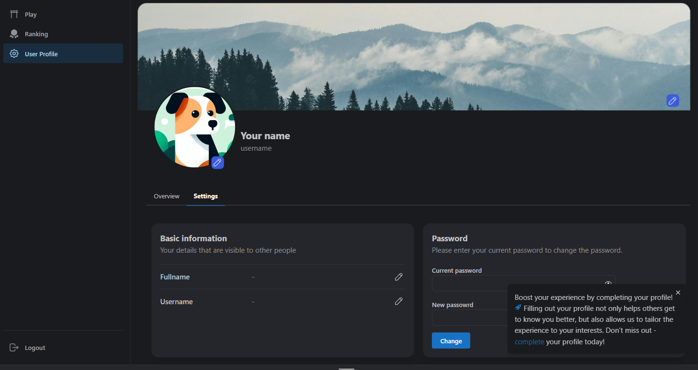
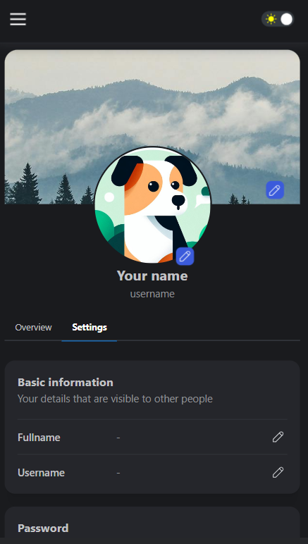
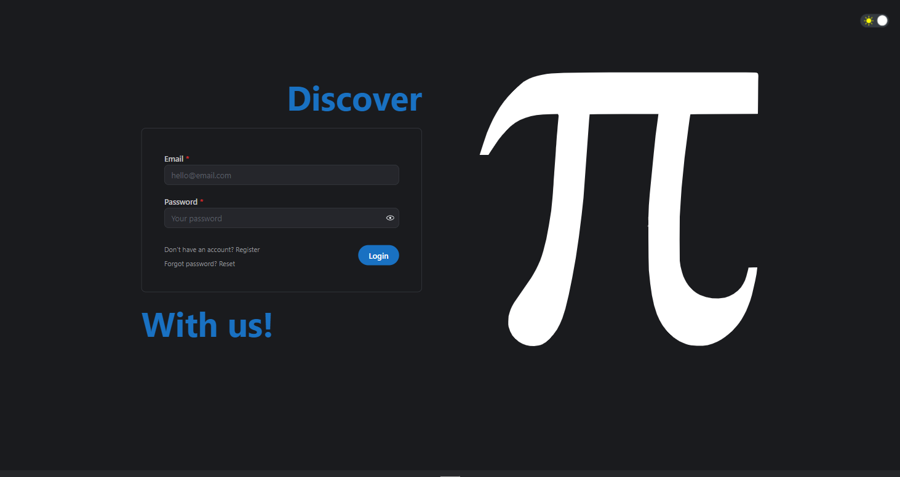
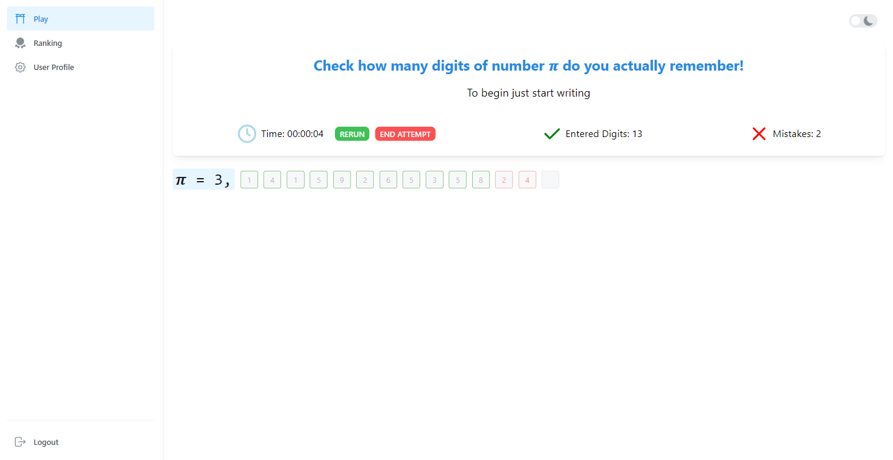

<h1 align="center">Pi project &pi;</h1>

The purpose of this project was to create something uncommon, but something that offers the most common features which  web app offers, in order to learn how to implement them and learn new things. It is fullstack project - that means it has its own backend written in Nodejs using Express, database on MongoDB and frontend in React. This greatly showed me how the whole process of building complete web app looks like and general developing flow.

Project is hosted on [onrender.com](https://render.com/). If you try to login or send any request for the first time you might wait a bit. This is beacuse of the server getting cold start. The servers on free tier plans "go to sleep" after 30 minutes and to "wake" them up again it takes about 30 seconds. Then they work with normal speed.

## Technologies used in project

## Account for tests
- Email: `123@123.pl`
- Hasło: `1234`

## 🚀 Features and solutions applied in project
Dealing with making requests to server, handling responses, errors, loading states and authentication was implemented using vanilla JS fetch API and React custom hooks. They make it easy to send POST, GET and  other requests without worrying about repeatedly handling requests states. 
1. **Full authentication flow:**
   - frontend:
     1. Interface that enables user to register new account and login
     2. Preventing not logged in users from viewing private routes
     3. Button that enable user to logout
   - backend:
     1. Protecting private routes from not logged in users
     2. Verifying entered login data and authenticating user with JWT Tokens
     3. Verifying entered register account data and create new account for the user
2. **Reseting password:**
   - frontend:
     1. Interface that enables user to reset his password by passing account's email
     2. Form that allow user to set new password
   - backend:
     1. Verifying if account with entered email exists and if so, sending email with reset account link using nodemailer
     2. Changing user's password to the new entered password
3. **Changing password:**
    - frontend:
      1. Form in user's settings tab that enables him edit to password
    - backend:
      1. Verifying if current password is valid and changes password to new one
4. **Refresh tokens flow:**
   - frontend:
     1. Modal that is appending after refresh token expires and informing user that he has to log in again to renew his session and autologout him
   - backend:
     1. If auth token expires, server verifies refresh token and if it is still valid it creates new auth token and send it to the client, otherwise it sends response that request is not authenticated
5. **Handling responses, errors and loading state:**
   - frontend:
     1. Loader appends at the middle of the screen on every request
     2. User is informed if the action he made was successful or not
     3. If there is an error returned from backend it is displayed in notification or in other place with the message of the error
   - backend:
     1. If anything goes wrong and server can't fulfill user request it returns error or response with appropriate message
6. **Auto-refreshing after user succesfully changed data:**
   - frontend:
     1. If user changed for example his profile image it will automatically send new request and load new data, there is no need to refresh page
7. **Adding images**
   - frontend:
     1. Implemented dropzone modal, there is also option to choose files from file explorer
     2. Implemented image cropper to cut image in the way the user wants
     3. Files are converted to Base64
8. **Managing state if there is no data to display:**
   - frontend:
     1. Places for images have placeholders if there is no image
     2. If request return empty list a message that there is no data to display is showed
9. **Dark and light mode**
10. **`404` Not found page**
## General features

1. Every user with account has his own **customizable** profile. He can set his name, username, profile image as well as background image.
2. If user has not updated his profile yet, the **popup** that is enhacing him to fill his profile with information appends in the right down corner of screen.

## Writing PI attempt
Whenever user starts typing, **timer** automatically starts and every digit he enters is immediately **verificated**. If he enters correct one - input becomes green, otherwise if he makes a mistake it becomes red. User can correct his answers. During attempt entered digits and made mistakes are **counted**. User can **stop** his attempt and rerun it again or end. If he ends attempt, the modal with **statistics** appears and after clicking restart button, everything resets and his attemp is saved to database and can be seen in **ranking view**. 

## 📱 Responsiveness
Appliaction is fully responsive and can be used on devices with diffrent screen sizes.
## 📝 Things to be done
This project has not been ended yet. Features and things that I would like to add in the future:
- adding pagination to ranking and better displaying attempts
- expand user profile with other tabs
- add last attempts and charts to statistics tab in user profile
- enabling users to view others profiles
- writing **tests**

## 📸 Screenshots

